# Безопасная газовая плита с компьютерным зрением

## Что это?

Система компьютерного зрения для обеспечения безопасности на кухне. Проект объединяет два ключевых модуля: автоматическое распознавание показаний газового счетчика и мониторинг присутствия человека для предотвращения аварийных ситуаций.

### Ключевые возможности:
- **Автоматическое снятие показаний** газового счетчика с точностью 99.81 %
- **Мониторинг работы газа** в реальном времени
- **Отслеживание присутствия человека** на кухне
- **Интеллектуальные оповещения** через Telegram-бота

## Как это работает

### 1. Контроль газа
Камера направлена на газовый счетчик и определяет:
- **Есть ли изменения** на счетчике (горит ли газ в данный момент);
- Если газ включен, система засекает время его работы.

### 2. Контроль присутствия человека
Вторая камера отслеживает пространство кухни:
- Фиксирует, был ли человек в кадре за последние 10 минут;
- Распознавание присутствия осуществляется средствами компьютерного зрения.

### 3. Оповещение
Если газ включен **И** человека нет на кухне дольше 10 минут →  
📨 **Telegram-бот отправляет предупреждение**

## Схема работы

```
Камера счетчика → Видит изменения → Газ включен
                                    ↓
Камера кухни → Нет человека 10 мин → ОПАСНО!
                                    ↓
                        Telegram-сообщение
```

## 📁 Структура проекта

```
project/
├── data/
│   ├── raw/                  # Исходные снимки с камеры (без обработки)
│   │   └── 2026-07-14/
│   │       ├── morning_01.jpg
│   │       ├── afternoon_02.jpg
│   │       └── evening_03.jpg
│   ├── processed/            # После предварительной обработки (OpenCV)
│   │   ├── crops/            # Нарезанные символы (цифры)
│   │   └── metadata.json     # Координаты ограничивающих рамок, время съемки
│   ├── train/                # Тренировочный датасет (70 %)
│   ├── val/                  # Валидационный датасет (15 %)
│   └── test/                 # Тестовый датасет (15 %, зафиксирован!)
│       ├── images/           # 500 изображений
│       └── labels.txt        # Правильные ответы
├── src/
│   ├── preprocessing/
│   │   ├── image_processor.py   # Бинаризация, подавление шума, нарезка
│   │   ├── crop_optimizer.py    # Padding, интерполяция
│   │   └── dataset_splitter.py  # Разбивка на train/val/test
│   ├── models/
│   │   ├── cnn_model.py         # Архитектура нейросети
│   │   ├── trainer.py           # Цикл обучения
│   │   └── predict.py           # Инференс (получение предсказаний)
│   ├── utils/
│   │   ├── metrics.py           # Метрики (Accuracy, Confusion Matrix)
│   │   └── visualizer.py        # Графики, визуализация ошибок
│   └── config.py                # Все гиперпараметры и настройки
├── notebooks/
│   └── eda.ipynb                # Исследовательский анализ данных
├── results/
│   ├── models/                  # Сохраненные веса моделей (.pth, .h5)
│   ├── logs/                    # Логи для TensorBoard
│   └── plots/                   # Графики обучения
│       ├── loss_curve.png
│       ├── accuracy_curve.png
│       └── confusion_matrix.png
├── requirements.txt
├── Dockerfile
└── README.md
```

---

### Архитектура нейросети
```
Input (128x64) → Conv(32) → Conv(64) → Conv(128) → Dense(256) → Dense(128) → Softmax(10)
```

## Полный цикл работы системы

### Сценарий 1: Нормальная работа
```
1. PersonTracker обнаруживает человека → записывает last_seen в Redis
2. Газовый датчик неактивен (gas_flow = '0' или отсутствует)
3. SafetyMonitor проверяет: газ не идет → тревога не создается
4. Система находится в режиме ожидания
```

### Сценарий 2: Обнаружение утечки газа
```
1. Газовый датчик срабатывает → API устанавливает gas_flow = '1' на 5 минут
2. PersonTracker не видит человека дольше 5 минут (last_seen устаревает)
3. SafetyMonitor проверяет каждые 10 секунд:
   ✅ gas_flow == '1'
   ✅ last_seen > 300 секунд
   ✅ alert_triggered отсутствует
   ✅ startup_mode отсутствует
4. Создается alert_triggered = '1'
5. Отправляется сообщение в Telegram
```

### Сценарий 3: Человек вернулся
```
1. PersonTracker снова видит человека → обновляет last_seen
2. SafetyMonitor проверяет:
   ✅ last_seen обновлен (менее 300 сек)
   ❌ условие "нет человека" больше не выполняется
3. Alert НЕ отправляется (или сбрасывается?)
   (В коде нет автоматического сброса alert при появлении человека!)
```

### Сценарий 4: Отключение уведомлений (Cooldown)
```
1. Пользователь отправляет команду /silence в Telegram
2. Устанавливается alert_cooldown на 10 минут
3. SafetyMonitor видит активный cooldown и временно прекращает отправку новых уведомлений
4. Через 10 минут cooldown автоматически удаляется (TTL)
5. Если опасность (газ горит + никого нет) сохраняется, система возобновляет оповещения
```

### Сценарий 5: Режим запуска (первые 5 минут)
```
1. Система запускается → устанавливается ключ startup на 5 минут
2. RedisManager.set_timestamp_key(
    config.REDIS_KEYS['startup'], 
    config.STARTUP_DURATION  # 300 секунд
)
3. В SafetyMonitor:
   if RedisManager.key_exists(config.REDIS_KEYS['startup']):
       return  # НЕ проверять и НЕ отправлять тревоги
4. Через 5 минут ключ автоматически удаляется
```

# Этапы разработки

## Камера для счетчика и сбор данных

### 📷 Конструкция камеры
- **ESP32-CAM** с дополнительной **светодиодной подсветкой**;
- Подсветка включается **только на время съемки** (экономия энергии и продление срока службы светодиодов);
- Камера **закреплена неподвижно**, однако возможны:
  - Небольшие **вибрации**;
  - Микро-смещения от внешних воздействий.

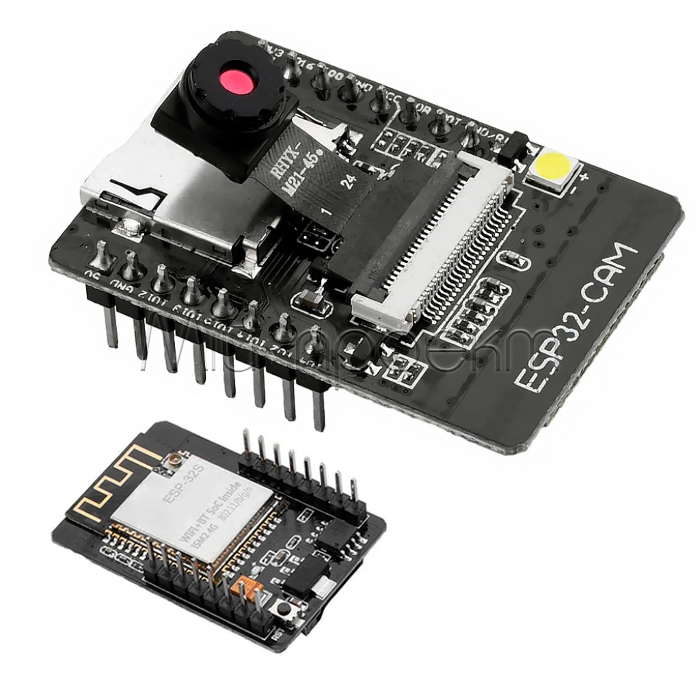
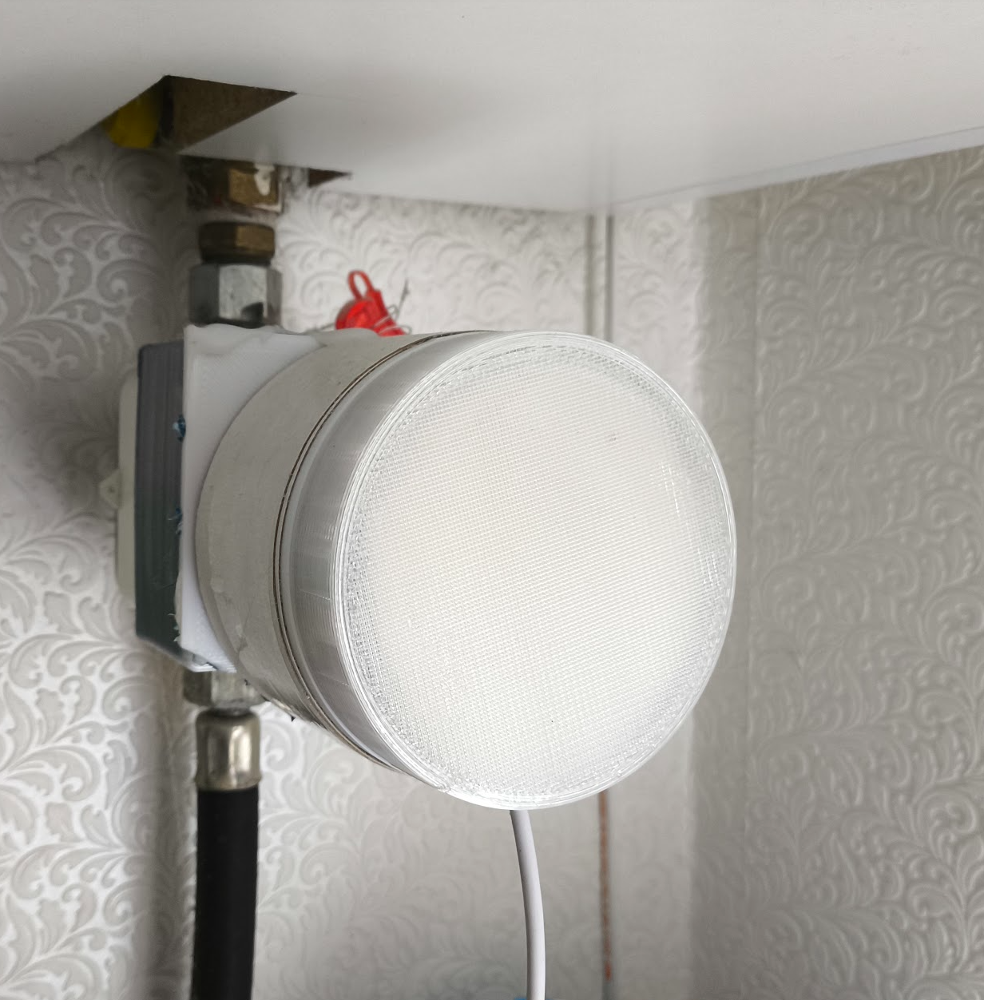

### 💡 Особенности освещения
- Так как подсветка не горит постоянно, камере требуется **время на адаптацию** при каждом включении;
- Освещение и фон могут **незначительно меняться** от кадра к кадру;
- Это учтено в системе: изображения **выравниваются по яркости** и проходят **бинаризацию**.

### 🧠 Подход к обучению
- Используется **минимальная аугментация** (легкий сдвиг, поворот до 10°);
- Это покрывает возможные вибрации и микро-смещения камеры;
- После предварительной обработки фон и освещение **унифицируются**, чтобы модель «видела» только цифры.

## Сбор данных со счетчика

Счетчик закреплен неподвижно, но возможны вибрации и небольшое смещение камеры из-за внешних воздействий.
<!-- 
<div style="display: flex; flex-wrap: wrap; gap: 10px;">
  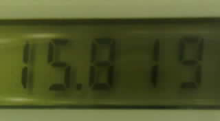
  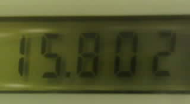
  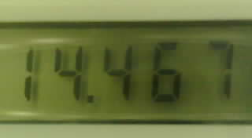
  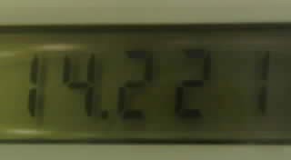
  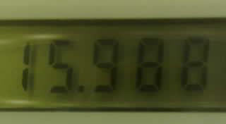
  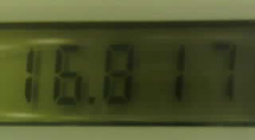
  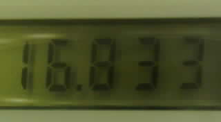
</div> -->

| | | |
|:-:|:-:|:-:|
||||
||||
||||


С помощью OpenCV выполнена сегментация данных, на основе которых впоследствии были созданы тренировочный и валидационный наборы.

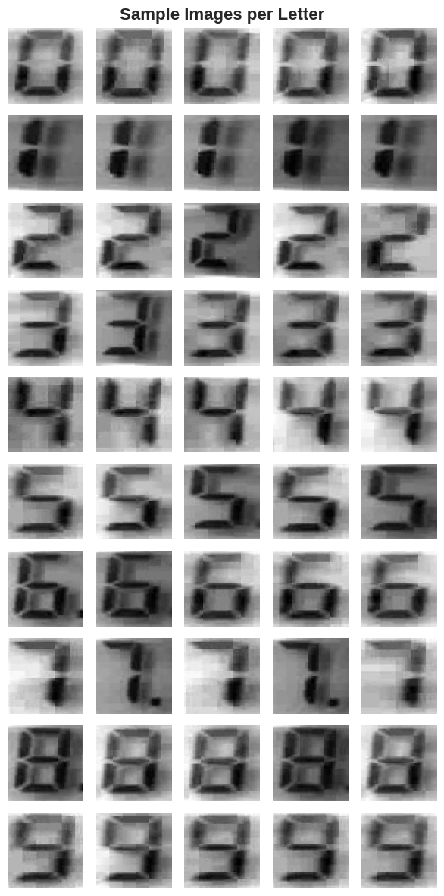
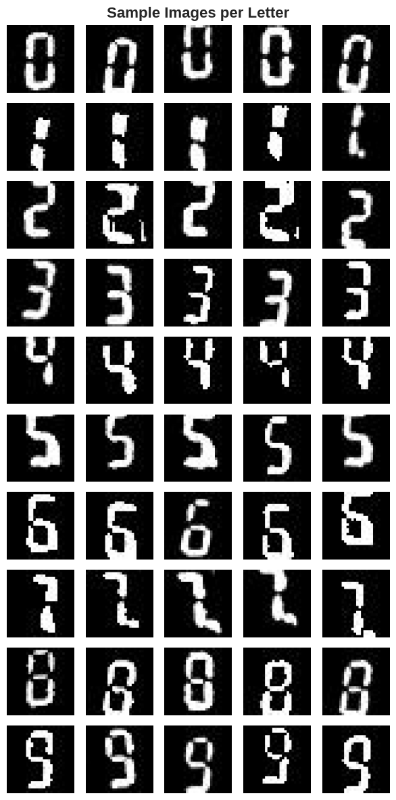

Так выглядят тренировочные данные после аугментации.

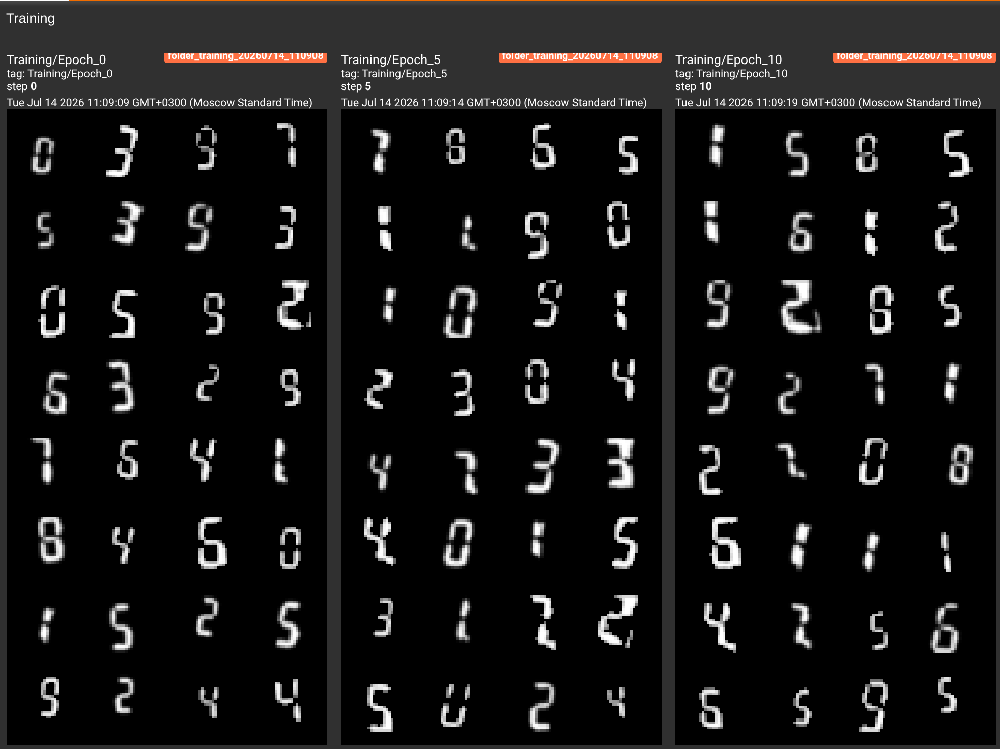

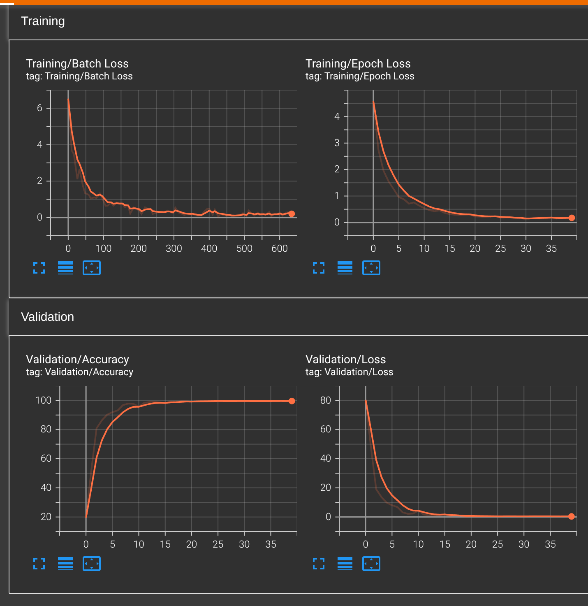

## Classification Report

| Класс | Точность (Precision) | Полнота (Recall) | F1-мера | Поддержка (Support) |
|-------|-------------------|------------------|---------|---------------------|
| 0     | 0.968             | 0.886            | 0.925   | 8204                |
| 1     | 0.953             | 0.974            | 0.964   | 8194                |
| 2     | 0.936             | 0.995            | 0.964   | 8198                |
| 3     | 0.985             | 0.949            | 0.966   | 8203                |
| 4     | 0.996             | 0.971            | 0.984   | 8190                |
| 5     | 0.937             | 0.960            | 0.948   | 8209                |
| 6     | 0.929             | 0.971            | 0.949   | 8204                |
| 7     | 1.000             | 0.940            | 0.969   | 8196                |
| 8     | 0.885             | 0.912            | 0.898   | 8126                |
| 9     | 0.882             | 0.901            | 0.891   | 8196                |

| Метрика | Значение |
|---------|----------|
| **Accuracy (Точность)** | **0.946** |
| **Macro Avg** | 0.947 / 0.946 / 0.946 |
| **Weighted Avg** | 0.947 / 0.946 / 0.946 |
| **Всего образцов** | 81920 |

---

### 🏆 Лучшая достигнутая точность: **99.66 %**

## Confusion Matrix


## Анализ ошибок модели на валидационном датасете

| Метрика | Значение |
| :--- | :--- |
| 📌 Всего обработано изображений | **2078** |
| ❌ Общее количество ошибок | **7** |
| ✅ Общее количество правильных ответов | **2071** |
| 🎯 Общая точность | **99.66 %** |

<br>

### 📈 Статистика по классам

| Класс | Всего изображений | Ошибок | Точность |
| :---: | :---: | :---: | :---: |
| **0** | 208 | 3 | 98.56 % |
| **1** | 208 | 0 | **100.00 %** |
| **2** | 208 | 0 | **100.00 %** |
| **3** | 208 | 0 | **100.00 %** |
| **4** | 208 | 0 | **100.00 %** |
| **5** | 208 | 1 | 99.52 % |
| **6** | 208 | 0 | **100.00 %** |
| **7** | 208 | 0 | **100.00 %** |
| **8** | 206 | 3 | 98.54 % |
| **9** | 208 | 0 | **100.00 %** |

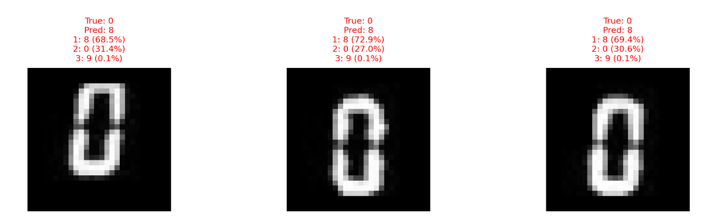
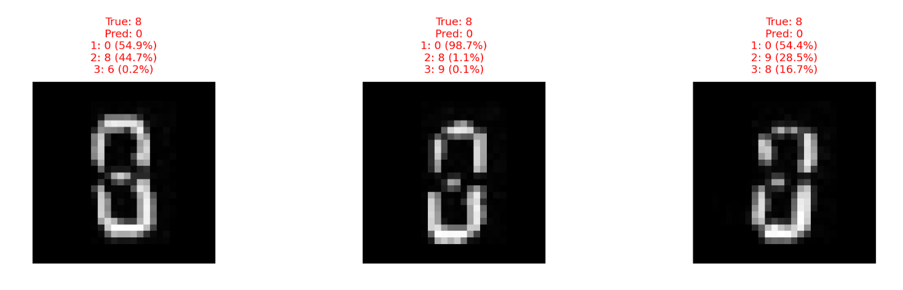
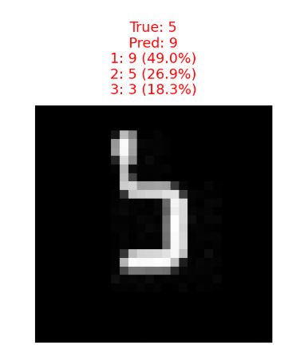

---

**Анализ ошибок и предложения по улучшению:**

1. **Проблема толщины линий (0 и 8):** Глядя на ошибочные изображения, можно заметить, что модель склонна путать **0** и **8** в случае толстых или плотных линий. Из-за схожести формы модель чаще отдает предпочтение нулю и ошибается.  
   *Решение:* Добавить в датасет больше примеров с различной толщиной штриха (как толстых, так и тонких цифр) и проследить, как это повлияет на точность.

2. **Плохое распознавание тонких линий (цифра 8):** Модель не всегда находит тонкую перемычку (среднюю палочку) у восьмерки.  
   *Решение:* Расширить обучающую выборку аналогичными примерами, чтобы модель акцентировала внимание на этой ключевой детали.

3. **Проблема с цифрой 5 (чрезмерная аугментация):** В последнем случае с пятеркой часть цифры была сильно обрезана или смещена, вероятно, из-за чрезмерной аугментации (изменений формы, масштаба или положения). В реальных условиях такой сильной деформации не возникает.  
   *Решение:* Уменьшить степень аугментации для валидационных данных, чтобы избежать появления нереалистичных артефактов, которые не должны встречаться на практике.

## Технологии

- **Python + PyTorch** — нейросети;
- **OpenCV** — работа с видео и изображениями;
- **Telegram API** — оповещения;
- **YOLO / CNN** — распознавание объектов и цифр.

## Итог

**Полностью автоматизированная система безопасности:**
- Следит за работой газа;
- Отслеживает присутствие человека;
- Предупреждает об опасности.